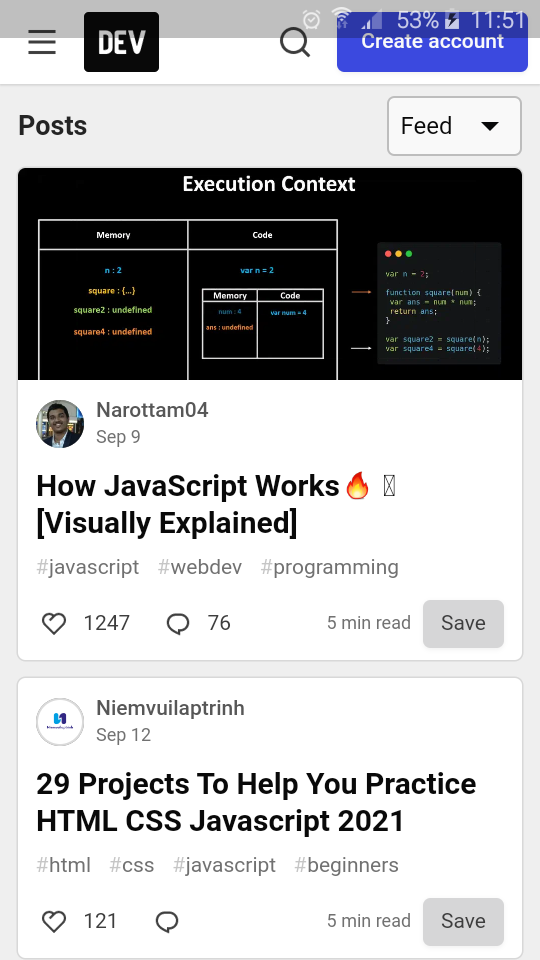

# flutterwebview
flutterwebview and permission

FLUTTER WEBVIEW and ANDROID PERSMISSION CONTROL

pls read the docs

https://pub.dev/packages/webview_flutter

https://stackoverflow.com/questions/60829199/flutter-webviews-gives-neterr-cache-miss-message#61358165

